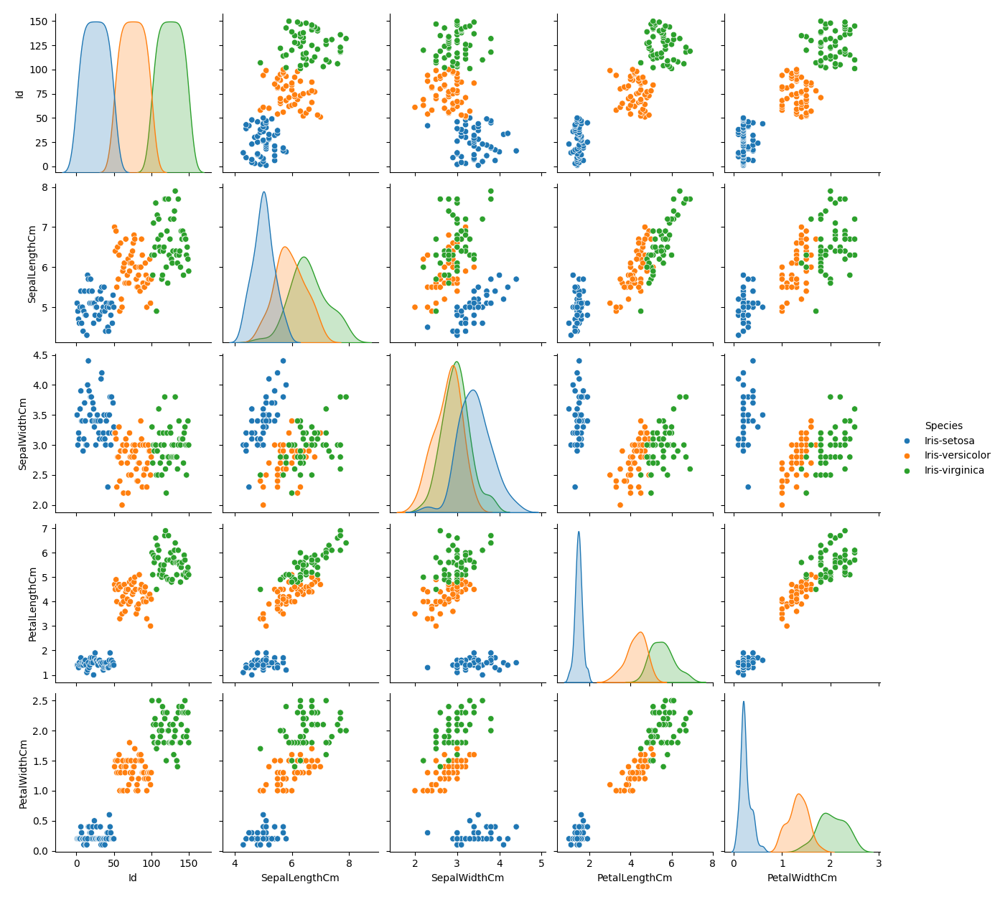

# 🌸 Iris Flower – EDA & Classification

This project uses the Iris dataset to:
- Visualize feature relationships with a pair plot
- Train a Random Forest model to classify species

## 📊 EDA Highlights:
- Clear separation of *Iris-setosa*
- Petal features are most useful for classification
- Used Seaborn’s pair plot for feature-wise visualization

## 🤖 Model:
- Algorithm: Random Forest
- Evaluation: Accuracy + Classification Report
- Tools: Python, Pandas, Seaborn, Scikit-learn

## 🔧 Run it:
1. Ensure `iris.csv` is present
2. Run `iris_project.py`
